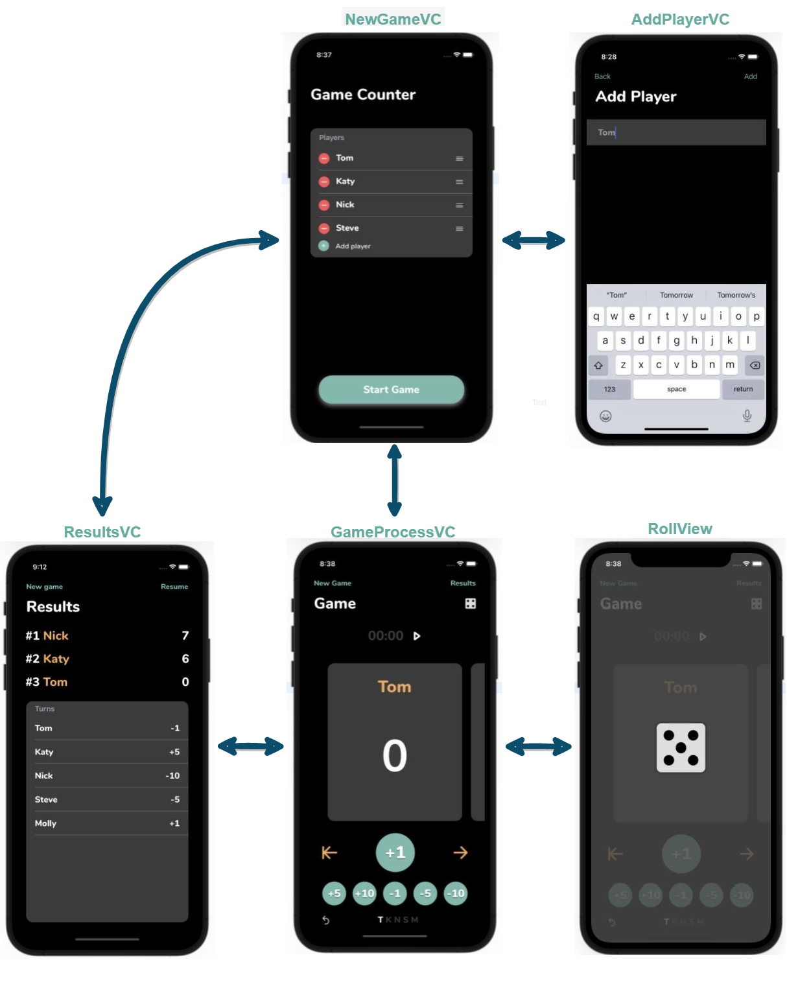

# Game score counter

An iOS application that counts players scores.

## What I Learned
 - layout from code
 - load/save data to device in json format
 - supporting IOS 12.1+ version
 - ```UITableView```, ```UICollectionView```, ```UIStackView```, ```UINavigationView```, ```NSAtributedString```

   ## Prototype
   

   ## Workflow 
      
  
